# 🤚 Smart Gesture Sensing Code-Lock System

[](https://arduino.cc)
[](https://isocpp.org/)
[](https://en.wikipedia.org/wiki/Access_control)
[](https://en.wikipedia.org/wiki/Gesture_recognition)

> An advanced door lock system built using an Arduino Uno microcontroller, a PAJ7620 gesture sensor, and a 16x2 LCD display. The system utilizes gesture recognition technology to offer secure, touchless access through customized hand gesture patterns.

## 🚀 Features

- ✅ **Gesture Recognition Technology** - PAJ7620 sensor with 9 distinct gestures
- ✅ **Touchless Access Control** - Secure entry without physical contact
- ✅ **Customizable Lock Code** - Unique gesture sequence configuration
- ✅ **Real-time LCD Feedback** - Clear visual guidance and status updates
- ✅ **Security Features** - Wrong attempt tracking and lockout system
- ✅ **Multi-layered Authentication** - Complex gesture combinations
- ✅ **Reset Functionality** - Easy code reset with gesture commands
- ✅ **Visual Indicators** - Custom characters for lock status display

## 🌟 Overview

This project features an advanced door lock system that utilizes gesture recognition technology to offer secure, touchless access through customized hand gesture patterns. With support for nine distinct gestures, users can configure a unique sequence as their personal lock code. The integrated LCD screen provides clear, real-time feedback, guiding users through the locking and unlocking process.

The system offers enhanced security through multiple wrong attempt tracking and automatic lockout functionality, making it ideal for modern access control applications where hygiene and security are paramount.

## 🏗️ System Architecture

```mermaid
graph TB
    subgraph "Input Layer"
        A[🤚 PAJ7620 Gesture Sensor] --> B[📊 9 Gesture Recognition]
        B --> C[🎯 Pattern Detection]
    end
    
    subgraph "Processing Unit"
        C --> D[🤖 Arduino Uno Controller]
        D --> E[📝 Code Validation Logic]
        E --> F[🔐 Security Management]
    end
    
    subgraph "Feedback System"
        F --> G[📺 16x2 LCD Display]
        G --> H[💬 Real-time Messages]
        H --> I[🎨 Custom Characters]
    end
    
    subgraph "Security Features"
        F --> J[⚠️ Wrong Attempt Tracking]
        J --> K[🚫 Lockout System]
        K --> L[🔒 Access Control]
    end
```



## 🔧 Hardware Requirements

### 📦 Components

- Arduino Uno microcontroller
- PAJ7620 gesture sensor
- 16x2 LCD display
- Connecting wires
- Breadboard or PCB for prototyping
- Power supply (USB or external)

### 🔌 Pin Connections

| Component | Arduino Pin | Pin Type | Function |
|-----------|-------------|----------|----------|
| **LCD Display** | 12, 11, 5, 4, 3, 2 | Digital | Display control pins |
| **LCD Contrast** | 6 | PWM | Contrast adjustment |
| **PAJ7620 Sensor** | SDA, SCL | I2C | Gesture data communication |
| **Power** | 5V | Power Rail | Component power supply |
| **Ground** | GND | Ground Rail | Common ground reference |

## 🎯 Gesture Recognition System

### Supported Gestures

| Gesture | Code Value | Description |
|---------|------------|-------------|
| **Up** | 5 | Upward hand movement |
| **Down** | 6 | Downward hand movement |
| **Forward** | 0 | Forward push motion |
| **Backward** | 1 | Backward pull motion |
| **Clockwise** | 2 | Circular clockwise rotation |
| **Anti-clockwise** | 3 | Circular counter-clockwise rotation |
| **Wave** | 4 | Side-to-side waving motion |
| **Right** | - | Reset command |
| **Left** | - | Unlock/Verify command |

### Default Unlock Code

The system is pre-configured with the gesture sequence: **5-6-2-4**
- Up → Down → Clockwise → Wave

## 💻 Software Setup

### Prerequisites

- Arduino IDE installed on your computer
- PAJ7620 gesture sensor library
- LiquidCrystal library (included in Arduino IDE)
- USB cable to connect Arduino to computer

### Installation

1. Clone or download this repository
2. Install the PAJ7620 library in Arduino IDE
3. Open `Gesture_Sensing_Codelock.ino` in Arduino IDE
4. Connect your Arduino board to your computer
5. Select the correct board (Arduino Uno) and port in Arduino IDE
6. Upload the code to your Arduino

### Required Libraries

```cpp
#include <Wire.h>
#include "paj7620.h"
#include <LiquidCrystal.h>
```

## 🔄 How It Works

### Gesture Input Process

1. **Initialization**: System starts with "Enter gesture" message on LCD
2. **Gesture Detection**: PAJ7620 sensor continuously monitors for hand movements
3. **Code Building**: Each recognized gesture adds to the 4-digit code sequence
4. **Verification**: Left gesture triggers code validation
5. **Access Control**: System grants or denies access based on code match

### Security Logic

```cpp
// Default unlock sequence: Up(5) → Down(6) → Clockwise(2) → Wave(4)
if (code[0]=='5' && code[1]=='6' && code[2]=='2' && code[3]=='4' && wrongcount < 2) {
    // Access granted
    lcd.print("Unlocked");
    // Display smile character
} else {
    // Security measures activated
    wrongcount++;
    // Progressive lockout system
}
```

### Display Feedback

- **Real-time Gesture Display**: Shows current gesture being performed
- **Custom Characters**: Heart and smile symbols for status indication
- **Security Messages**: Progressive warning system for wrong attempts
- **Status Updates**: Clear feedback for lock/unlock operations

## 📱 Usage Instructions

### Normal Operation

1. **Power on** the system
2. **Position hand** 10-20cm from the PAJ7620 sensor
3. **Perform gestures** in sequence: Up → Down → Clockwise → Wave
4. **Execute Left gesture** to verify and unlock
5. **Monitor LCD** for real-time feedback

### Reset Functionality

- **Right gesture**: Resets current code input
- **System restart**: Clears all attempts and counters

### Security Features

- **First wrong attempt**: "Wrong, locked" message
- **Second wrong attempt**: "Security alert" message
- **Third wrong attempt**: "Completely locked" - system lockout

## 🔧 Troubleshooting

### Common Issues

**Gesture not recognized:**
- Check sensor positioning (10-20cm distance)
- Ensure proper lighting conditions
- Verify I2C connections (SDA/SCL pins)
- Monitor serial output for gesture detection

**LCD display issues:**
- Verify all 6 LCD pin connections
- Adjust contrast using PWM on pin 6
- Check power supply stability

**System not responding:**
- Verify PAJ7620 initialization in serial monitor
- Check I2C communication
- Ensure all libraries are properly installed

### Debugging

Monitor system status through Serial Monitor:
1. Open Arduino IDE
2. Go to Tools → Serial Monitor
3. Set baud rate to 9600
4. Observe gesture detection and system messages

## ⚙️ Customization Options

### Changing the Unlock Code

Modify the validation logic in the code:

```cpp
// Change this line to set new unlock sequence
if (code[0]=='X' && code[1]=='Y' && code[2]=='Z' && code[3]=='W' && wrongcount < 2) {
```

### Timing Adjustments

```cpp
#define GES_REACTION_TIME 500    // Gesture reaction delay
#define GES_ENTRY_TIME 800       // Multi-gesture entry time
#define GES_QUIT_TIME 1000       // Gesture completion time
```

### LCD Contrast

```cpp
int Contrast = 60;  // Adjust value (0-255) for optimal display
```

## 🔒 Security Considerations

- **Physical Security**: Protect sensor from tampering or obstruction
- **Code Complexity**: Use diverse gesture combinations for better security
- **Reset Protection**: Secure physical access to reset functionality
- **Environmental Factors**: Consider lighting and space requirements
- **Backup Access**: Implement alternative access method for emergencies

## 🎯 Applications

### Use Cases

- **Smart Door Locks**: Touchless home/office entry systems
- **Access Control**: Secure area management
- **Hygiene-Critical Environments**: Hospitals, laboratories, clean rooms
- **Disability Accessibility**: Alternative access for mobility-impaired users
- **IoT Security**: Integration with smart home systems

### Enhancement Ideas

- **Wireless Connectivity**: WiFi/Bluetooth integration
- **Mobile App Control**: Smartphone-based management
- **Multiple User Codes**: Support for different user profiles
- **Audit Logging**: Access attempt tracking and reporting
- **Biometric Integration**: Combine with fingerprint or facial recognition

**Note**: This system provides basic access control functionality. For high-security applications, additional security measures and professional installation are recommended.
